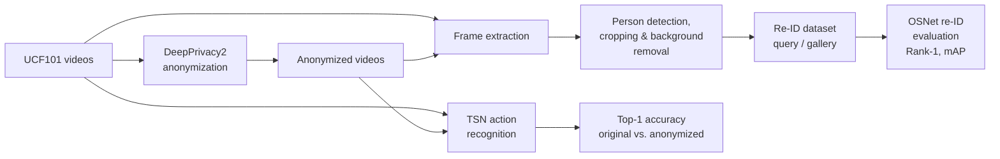

# Privacy-Preserving Video Anonymization with DeepPrivacy2

**MSc Project — Pose-Conditioned GANs with Temporal Consistency for Privacy-Preserving Action Recognition**

This project builds and evaluates a full video anonymization pipeline around
[DeepPrivacy2](https://github.com/hukkelas/deep_privacy2), a pose-conditioned generative
adversarial network. Videos from the UCF101 action recognition dataset are anonymized
end-to-end, and the result is assessed along two axes:

- **Privacy** — can an anonymized person still be matched back to their original
  appearance? Measured with an OSNet-based person re-identification (re-ID) protocol.
- **Utility** — does the anonymized footage remain usable for downstream tasks?
  Measured with action recognition accuracy (MMAction2 TSN) on original vs. anonymized videos.

The pipeline was developed and run on a SLURM-managed HPC cluster (Cirrus/ARCHER2-style
`/work` filesystem), with a CPU preprocessing stage and a GPU evaluation stage.

---

## Table of Contents

1. [Pipeline Overview](#pipeline-overview)
2. [Repository Structure](#repository-structure)
3. [External Components](#external-components)
4. [Results](#results)
5. [Evaluation Methodology](#evaluation-methodology)
6. [Usage](#usage)
7. [Environment Setup](#environment-setup)
8. [Limitations and Future Work](#limitations-and-future-work)
9. [Acknowledgments](#acknowledgments)

---

## Pipeline Overview



Two evaluation tracks share the same anonymized outputs:

| Track | Question | Tooling |
|---|---|---|
| **Privacy (re-ID)** | Can anonymized frames be matched to the originals? | MediaPipe (pose + segmentation), OSNet via TorchReID |
| **Utility (action recognition)** | Is the action still recognizable after anonymization? | MMAction2 TSN (ResNet-50, UCF101 checkpoint) |

## Repository Structure

This repository contains the **scripts, job files, and environment specifications**.
Datasets, model checkpoints, and generated outputs live on the cluster and are
git-ignored (see [External Components](#external-components)).

```
.
├── README.md
├── environment/
│   ├── dp2_requirements.txt        # Full pinned environment for DeepPrivacy2 anonymization
│   ├── eval_requirements.txt       # Environment for privacy/utility evaluation
│   ├── minimal_requirements.txt    # Minimal evaluation environment (no MMAction2)
│   ├── all_ucf101_videos.txt       # Manifest of all 13,320 UCF101 videos
│   └── ucf101_part_0[0-3]          # Manifest split into 4 parts for SLURM array jobs
├── scripts/
│   ├── README.md                   # Detailed pipeline documentation
│   ├── dataset_prep/
│   │   ├── process_ucf_dp2.py      # Batch-anonymize UCF101 with DeepPrivacy2 (resumable)
│   │   └── process_ucf101_array.slurm  # SLURM array job for parallel anonymization
│   ├── re-id/
│   │   ├── videos_to_frames.py     # Frame extraction from original/anonymized video pairs
│   │   ├── crop_fullbody.py        # Pose-based person cropping + background removal
│   │   ├── organize_reid_data.py   # Build query/gallery structure for re-ID evaluation
│   │   └── evaluate_reid_osnet.py  # OSNet feature extraction + Rank-1 / mAP evaluation
│   ├── evaluation/
│   │   ├── cpu_preprocessing.slurm # Stage 1: frames + crops + organization (CPU partition)
│   │   └── gpu_evaluation.slurm    # Stage 2: OSNet re-ID evaluation (GPU partition)
│   └── utility/
│       ├── evaluate_top1_accuracy_tsn.py   # TSN Top-1 accuracy, original vs. anonymized
│       └── README_top1_evaluation.md       # Utility evaluation documentation
└── src/                            # Reserved for shared library code
```

## External Components

The pipeline depends on external repositories checked out alongside this project on the
cluster (not vendored here):

| Component | Role |
|---|---|
| [DeepPrivacy2](https://github.com/hukkelas/deep_privacy2) | Pose-conditioned GAN performing the full-body anonymization |
| [Detectron2](https://github.com/facebookresearch/detectron2) (+ DensePose) | Person detection and dense pose estimation for DeepPrivacy2 |
| [MMAction2](https://github.com/open-mmlab/mmaction2) | TSN action recognition for the utility evaluation |
| [TorchReID](https://github.com/KaiyangZhou/deep-person-reid) | OSNet feature extractor and re-ID metrics |
| [MediaPipe](https://developers.google.com/mediapipe) | Pose landmarks and person segmentation for cropping |

The exact commits used for DeepPrivacy2 and Detectron2 are recorded (commented) in
`environment/dp2_requirements.txt`. The UCF101 dataset and the TSN UCF101 checkpoint
(`tsn_r50_1x1x3_75e_ucf101_rgb`) are obtained from their official sources.

## Results

### Privacy — Re-Identification (single-video protocol, 121 frame pairs)

| Metric | Value |
|---|---|
| Rank-1 Accuracy | **9.92%** |
| mAP | **16.68%** |

Query images are original person crops; the gallery contains the corresponding
anonymized crops. Low matching scores indicate that OSNet features of the anonymized
frames are substantially decorrelated from the original appearance. See
[Evaluation Methodology](#evaluation-methodology) for the exact protocol and
[Limitations](#limitations-and-future-work) for the caveats that apply when
interpreting these numbers.

### Utility — Action Recognition

Top-1 accuracy is compared between original and anonymized videos on a UCF101 subset
using MMAction2's TSN model (`scripts/utility/evaluate_top1_accuracy_tsn.py`). The
script reports overall and per-class accuracy, the absolute and relative accuracy drop,
and a qualitative impact level (minimal / moderate / significant / severe). Full
numerical results are reported in the accompanying thesis.

## Evaluation Methodology

### Re-ID protocol

The privacy evaluation follows the re-identification approach used in the DeepPrivacy2
literature, adapted to paired original/anonymized footage:

1. **Frame extraction** — original and anonymized videos are decoded into aligned frame
   sequences (`videos_to_frames.py`).
2. **Person cropping** — MediaPipe pose landmarks define a padded full-body bounding
   box; MediaPipe selfie segmentation replaces the background with white so that re-ID
   features focus on the person, not the scene (`crop_fullbody.py`). OpenCV DNN models
   are supported as a fallback when MediaPipe is unavailable.
3. **Query/gallery construction** — original crops become the query set (camera `c1`)
   and anonymized crops the gallery (camera `c2`), using standard re-ID naming
   `{person_id}_{camera_id}_{video_id}_{frame}.jpg` (`organize_reid_data.py`).
4. **Matching** — OSNet (`osnet_x1_0`) extracts 512-d appearance features; cosine
   distance ranking yields CMC Rank-1 and mAP via TorchReID's evaluator
   (`evaluate_reid_osnet.py`).

Lower matching scores mean the anonymized appearance is harder to link back to the
original — i.e., stronger anonymization as measured by this protocol.

### Utility protocol

Matching original/anonymized video pairs are located by filename, and the same
pre-trained TSN model performs inference on both versions. The gap between the two
Top-1 accuracies quantifies how much task-relevant information the anonymization
preserves.

## Usage

### 1. Anonymize UCF101 with DeepPrivacy2

```bash
# Batch mode (resumable — skips already-processed videos)
python scripts/dataset_prep/process_ucf_dp2.py

# Or as a 4-way SLURM array job over the manifest splits
sbatch scripts/dataset_prep/process_ucf101_array.slurm
```

### 2. Re-ID privacy evaluation (two-stage SLURM pipeline)

```bash
# Stage 1: CPU preprocessing — frame extraction, cropping, dataset organization
sbatch scripts/evaluation/cpu_preprocessing.slurm

# Stage 2: GPU evaluation — OSNet feature extraction and ranking
sbatch scripts/evaluation/gpu_evaluation.slurm
```

The two-stage split keeps GPU allocations short: all decoding, cropping, and file
organization runs on the CPU partition, and the GPU job starts only once a
`preprocessing_complete.flag` marker exists.

The individual steps can also be run manually:

```bash
python scripts/re-id/videos_to_frames.py \
    --input_dir <videos> --output_dir <frames> --frame_interval 5 --skip_existing

python scripts/re-id/crop_fullbody.py \
    --input_dir <frames> --output_dir <crops> --skip_existing

python scripts/re-id/organize_reid_data.py \
    --original_cropped_dir <original_crops> \
    --anonymized_cropped_dir <anonymized_crops> \
    --output_dir datasets/reid_eval \
    --frames_per_person 130 --use_multiple_frames

python scripts/re-id/evaluate_reid_osnet.py \
    --query_dir datasets/reid_eval/query \
    --gallery_dir datasets/reid_eval/gallery
```

### 3. Action recognition utility evaluation

```bash
python scripts/utility/evaluate_top1_accuracy_tsn.py \
    --original_dir <path/to/UCF-101> \
    --anonymized_dir <path/to/ucf101_anonymized>
```

See `scripts/utility/README_top1_evaluation.md` for details.

## Environment Setup

Two conda environments are used, matching the two halves of the pipeline:

```bash
# Anonymization environment (DeepPrivacy2 + Detectron2/DensePose)
conda create -n dp2 python=3.8
conda activate dp2
pip install -r environment/dp2_requirements.txt

# Evaluation environment (TorchReID, MMAction2, MediaPipe)
conda create -n dp2_eval python=3.8
conda activate dp2_eval
pip install -r environment/eval_requirements.txt   # or minimal_requirements.txt
```

Prerequisites: Python 3.8+, a CUDA-capable GPU for anonymization and OSNet/TSN
inference, and FFmpeg-enabled OpenCV for video decoding. The SLURM scripts assume the
cluster layout described in `scripts/README.md` (paths under `/work/...` should be
adapted to your own allocation).

## Limitations and Future Work

These caveats are discussed in full in the thesis; they are summarized here so the
reported numbers are read in context:

- **Single-identity re-ID protocol.** The 121-frame evaluation pairs frames from one
  video, so each query has exactly one correct gallery match and all gallery images
  depict the same individual. The protocol therefore measures appearance
  decorrelation between original and anonymized frames rather than open-set
  re-identification across many identities. A natural extension is a multi-identity
  gallery — e.g., using UCF101 group IDs (`gXX`) as pseudo-identities — with the
  chance level reported alongside the scores.
- **No trivial-baseline comparison.** Blurring or pixelation baselines would help
  situate DeepPrivacy2's privacy/utility trade-off against simpler methods.
- **Frame alignment assumption.** Original/anonymized crops are paired by frame index,
  which assumes the anonymized re-encode preserves the frame count exactly.
- **Scale.** The privacy evaluation covers a single video pair and the utility
  evaluation a UCF101 subset; scaling both across the full dataset is future work.

## Acknowledgments

- **DeepPrivacy2** — Hukkelås & Lindseth, [hukkelas/deep_privacy2](https://github.com/hukkelas/deep_privacy2)
- **Detectron2 / DensePose** — Facebook AI Research
- **MMAction2** — OpenMMLab
- **OSNet / TorchReID** — Zhou et al., [KaiyangZhou/deep-person-reid](https://github.com/KaiyangZhou/deep-person-reid)
- **MediaPipe** — Google Research
- **UCF101** — Soomro et al., CRCV, University of Central Florida

This project was developed as part of an MSc dissertation. Code is provided for
academic research purposes; external components retain their own licenses.
